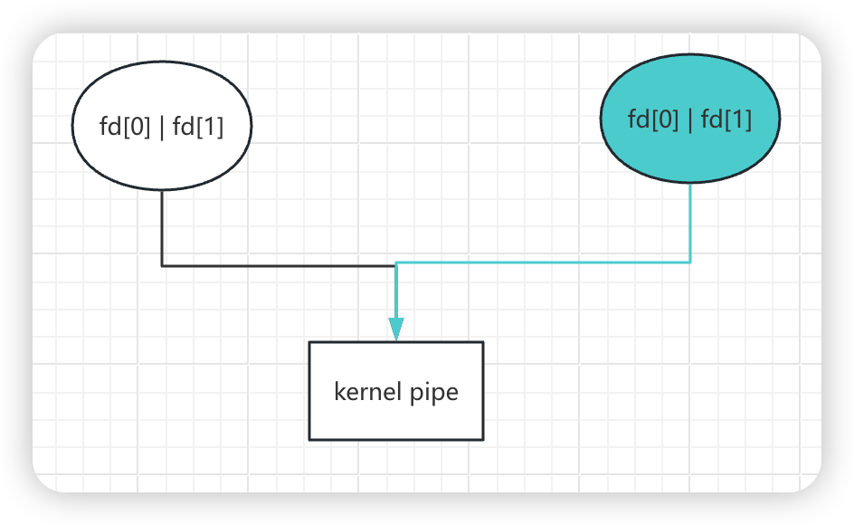
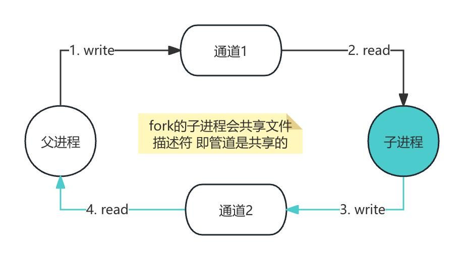
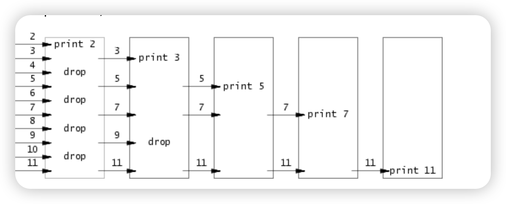
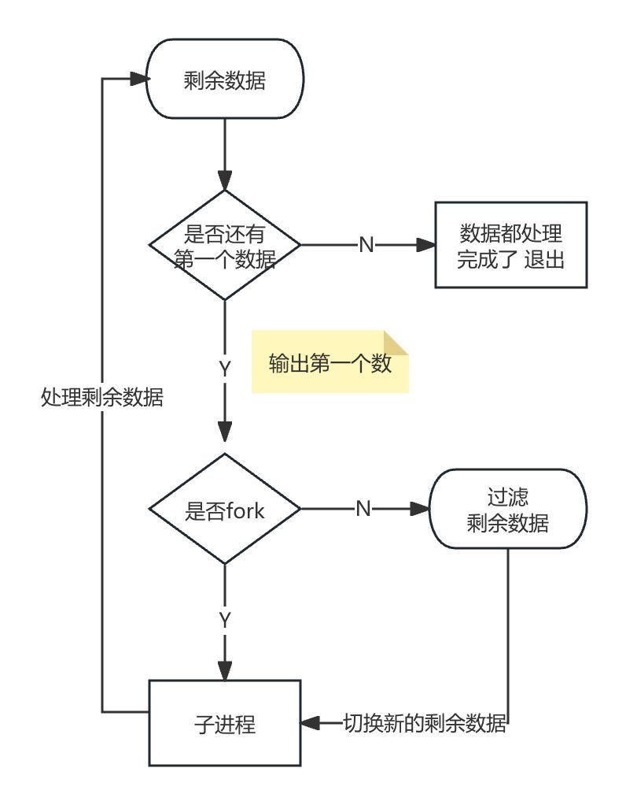
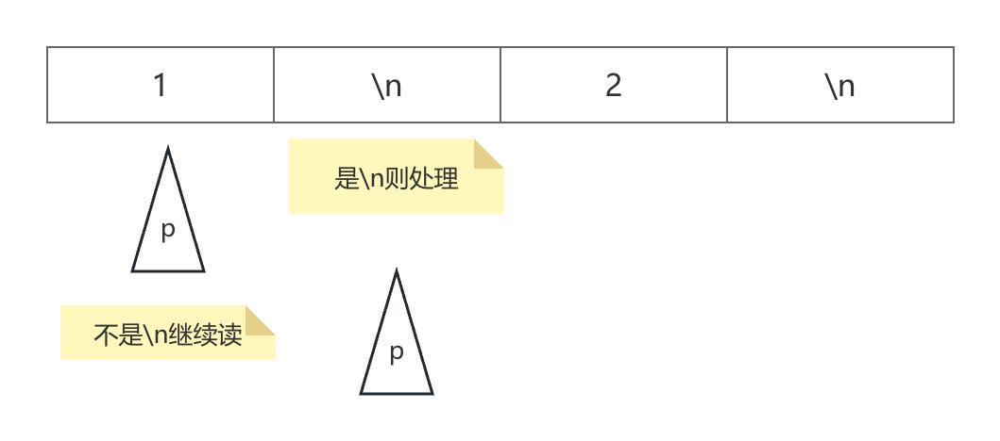

# 个人mit实验记录

## 1. mit6.s081

- 参考资料

| 简介            | 链接 |
|--------------------|--------------------------------------------|
| 2024实验课表              | [2024课程](https://pdos.csail.mit.edu/6.828/2024/schedule.html) |
| MIT6.S081课程            | [mit6.s081](https://mit-public-courses-cn-translatio.gitbook.io/mit6-s081) |
| xv6中文文档               | [xv6](https://th0ar.gitbooks.io/xv6-chinese/content/content/chapter2.html) |
| posix函数查询             | [posix](https://man7.org/linux/man-pages/) |
| CS自学指南-NIT6.S081      | [CS自学指南](https://csdiy.wiki/%E6%93%8D%E4%BD%9C%E7%B3%BB%E7%BB%9F/MIT6.S081/) |

- 环境 [搭建参考](https://pdos.csail.mit.edu/6.S081/2024/tools.html)

1. qemu安装 (mac系统)
```
brew tap riscv/riscv
brew install riscv-tools
brew install qemu
```

2. 2024代码下载
``` git
git clone git://g.csail.mit.edu/xv6-labs-2024
cd xv6-labs-2024
make qemu
```

### lab1 [util](https://pdos.csail.mit.edu/6.828/2024/labs/util.html)

#### 1. sleep (easy) [代码参考](./xv6-labs-2024/lab1:%20util/1.%20sleep/sleep.c)
```
调用sleep来实现休眠一定时间 实现在user/sleep.c
```

```
需要固定在Makefile文件下加入写好的 (后续就不在提示说明了 都需要添加)
UPROGS=\
    $U/_cat\
    ...
    $U/_zombie\
    $U/_sleep\

```

#### 2. pingpong (easy) [代码参考](./xv6-labs-2024/lab1:%20util/2.%20pingpong/pingpong.c)
```
使用管道 实现父子进程之间通信
1. 父进程发送数据给子进程
2. 子进程打印 printf("%d: received ping\n", getpid());
3. 子进程发送数据给父进程
4. 父进程打印 printf("%d: received pong\n", getpid());
实现在user/pingpong.c
```

- fork后 子进程默认复制父进程全部的文件描述符 需要分别各自关闭


- [pipe](https://man7.org/linux/man-pages/man2/pipe.2.html)
- [fork](https://man7.org/linux/man-pages/man2/fork.2.html)
- [dup](https://man7.org/linux/man-pages/man2/dup.2.html)
- [getpid](https://man7.org/linux/man-pages/man2/getpid.2.html)
- [read](https://man7.org/linux/man-pages/man2/read.2.html)
- [write](https://man7.org/linux/man-pages/man2/write.2.html)
- [printf](https://man7.org/linux/man-pages/man3/fprintf.3.html)

```
    int pipe(int pipefd[2]);
    pipefd[0]读端文件描述符 pipefd[1]写端文件描述符

    pid_t fork(void);
    在父进程中返回子进程id
    在子进程中返回0确认自己是子进程
    返回-1表示错误

    int dup(int oldfd);
    成功 新建一个文件描述符 共享文件偏移和文件状态（不包括关闭)
    失败 返回-1

    pid_t getpid(void);
    回调用该函数的进程的进程ID

    ssize_t read(int fd, void buf[.count], size_t count);
    成功 返回count的字节数 遇到文件结尾会提前返回
    失败 返回-1

    ssize_t write(int fd, const void buf[.count], size_t count);
    成功 返回实际写入的字节数 可能小于count（缓冲区溢出等情况）为0表示没写入任何数据
    失败 返回-1

    int printf(const char *restrict format, ...);
    失败 返回一个负数
```



#### 3. pingpong (moderate)/(hard) [代码参考](./xv6-labs-2024/lab1:%20util/3.%20primes/primes.c)

```
父进程给子进程发送[2,280]的数字 子进程筛掉并打印质数
实现在user/primes.c
```



- Bell Labs and CSP Threads [参考地址](https://swtch.com/~rsc/thread/)
- [wait](https://man7.org/linux/man-pages/man2/wait.2.html)

```
sizeof
返回当前系统所占字节数 如sizeof(int)返回int类型占当前系统的字节数

pid_t wait(int *_Nullable wstatus);
wait(&wstatus)等价于waitpid(-1, &wstatus, 0)
pid = -1 表示等待任意一个子进程

true不是内置的单词 while(true)是错误的 要换while(1)

函数需要先声明在使用
如:
void handle();

int main(int argc, char const *argv[]) {
    handle();
}

void handle() {
}
```



#### 4. find (moderate) [代码参考](./xv6-labs-2024/lab1:%20util/4.%20find/find.c)

```
实现find命令 参考user/ls.c文件
实现在user/find.c
```

- [open](https://man7.org/linux/man-pages/man2/open.2.html)
- [fstat](https://man7.org/linux/man-pages/man3/fstat.3p.html)
- [strcpy](https://man7.org/linux/man-pages/man3/strcpy.3.html)
- [memmove](https://man7.org/linux/man-pages/man3/memmove.3.html)
- [stat](https://man7.org/linux/man-pages/man2/stat.2.html)
- [strcmp](https://www.man7.org/linux/man-pages/man3/strcmp.3.html)

```
int open(const char *pathname, int flags, .../* mode_t mode */ );
成功 返回一个大于0的文件描述符

int fstat(int fildes, struct stat *buf);
成功：返回0，更新 st_uid、st_gid、st_size 和 st_mode 等字段 buf填充文件状态信息
常用字段 st_ino(文件inode编号) st_size(文件大小)

char *stpcpy(char *restrict dst, const char *restrict src);
将 src 所指向的字符串（包括字符串结束符 '\0'）复制到 dst 所指向的字符数组中

void *memmove(void dest[.n], const void src[.n], size_t n);
函数将 n 个字节从内存区域 src 复制到内存区域 dest

int stat(const char *restrict pathname,struct stat *restrict statbuf);
成功：返回0，statbuf填充有效数据

int strcmp(const char *s1, const char *s2);
0 s1=s2
>0 s1的字典序大于s2
<0 s1的字典序小于s2

struct dirent {
  ushort inum;
  char name[DIRSIZ];
};
目录也是一种特殊的文件 因此固定读dirent大小的文件就是遍历目录了

DIRSIZE默认为14大小 如果文件名超过14的话会截断
```

```
参考ls.c 如果文件名称匹配的情况就输出
如果是目录的话 就递归遍历
注意目录的拼接
// 假设path=. 下一级目录是a 则需要变成./a
strcpy(buf, path); // buf -> .
p = buf+strlen(buf);
*p = '/';
p++; // buf -> ./
memmove(p, de.name, DIRSIZ); // buf -> ./a
p[DIRSIZ] = 0; // 保证文件名格式 文件名要求是以\0结尾的
```

#### 5. xargs (moderate) [代码参考](./xv6-labs-2024/lab1:%20util/5.%20xargs/xargs.c)

```
xargs命令的作用就是将标准输入的内容转换为命令行参数
实现在user/xargs.c
find . b | sort
输出
./b

find . b | xargs sort
输出 ./b文件里面的内容排序
相当于sort ./b
```

```
使用如下命令当参考 (echo 1 ; echo 2) | xargs echo
输入是按\n分割的
传到标准输入中的内容是1\n2\n

字符的结束符是\0 因此收到1\n需要转成1\0去处理

main函数的argv中 0存储程序的名称 如0=xargs 1=echo
C字符串需要以\0结尾 但标准输入的原始字节流不包含\0 而是使用\n分割
如果输入里面有\n 则是0=\ 1=n 2=\n
```

- 标准输入的内容根据\n划分 然后依次执行


## 2. mit6.824 [syscall](https://pdos.csail.mit.edu/6.828/2024/labs/syscall.html)

#### gdb使用

- [在vscode上完美调试xv6指南](https://zhuanlan.zhihu.com/p/567525198)

#### 1. System call tracing (moderate) [代码参考](./xv6-labs-2024/lab2:%20syscall/1.%20system%20call%20tracing)
```
增加trace命令 打印进程ID、系统调用名称和返回值(保存在a0)
```
> **为什么用a0?**
>
> https://github.com/riscv-non-isa/riscv-elf-psabi-doc/blob/712449f8efcf6b3acd9e2a2a7ddfe89486317877/riscv-cc.adoc#integer-calling-convention

#### 2. attack xv6 (moderate) [代码参考](./xv6-labs-2024/lab2:%20syscall/2.%20attack%20xv6)

```
user/attack.c 中的secret最终分配到了那个页表上
```

- 参考文章 [attack xv6](https://nosae.top/posts/attack-xv6/)
- 查看日志 观察分配内存的0x0000000087f28000 最终是在第9页 [执行结果](./xv6-labs-2024/lab2:%20syscall/2.%20attack%20xv6/doc/执行结果.txt)

```
1. 按提示把页表清空部分都注释了
2. 根据页表的分配知道最终使用了那一块
```
