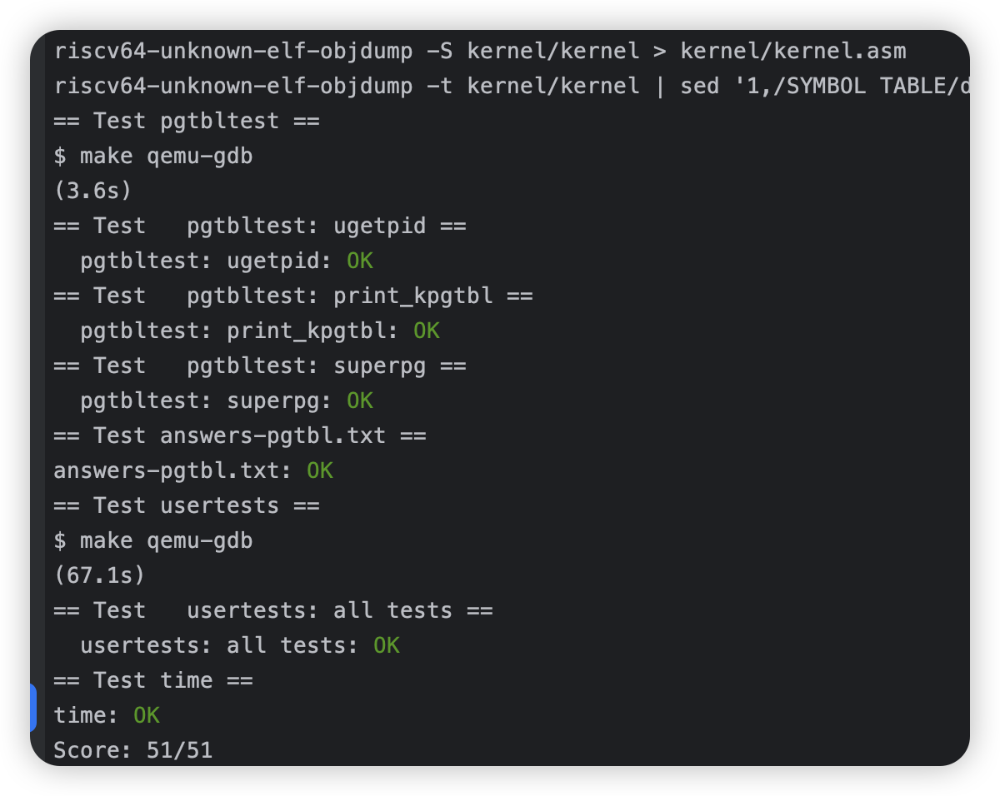
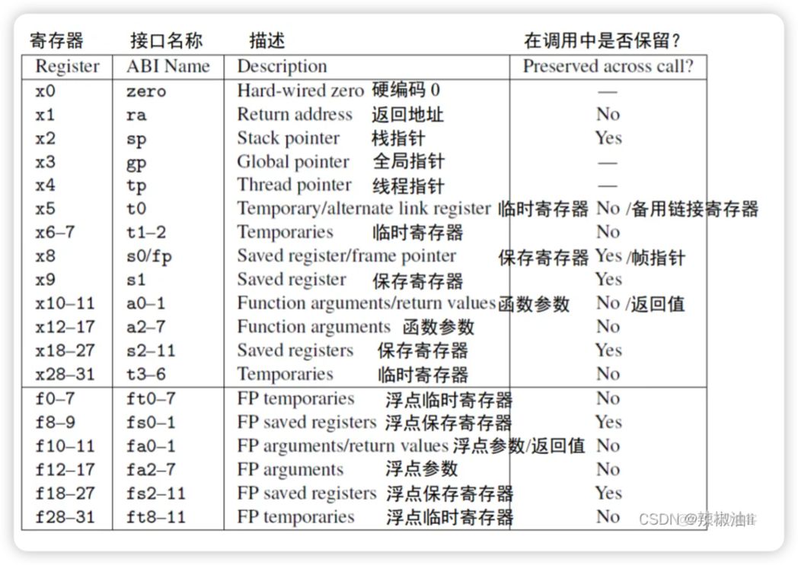
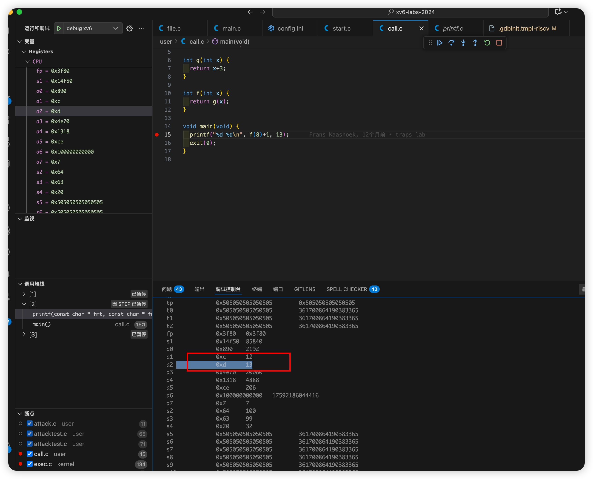

# 个人mit实验记录

## 一. mit6.s081 [2024]

- 参考资料

| 简介            | 链接 |
|--------------------|--------------------------------------------|
| 2024实验课表              | [2024课程](https://pdos.csail.mit.edu/6.828/2024/schedule.html) |
| MIT6.S081课程            | [mit6.s081](https://mit-public-courses-cn-translatio.gitbook.io/mit6-s081) |
| xv6文档                  | [xv6](https://xv6-guide.github.io/xv6-riscv-book) [xv6中文](https://th0ar.gitbooks.io/xv6-chinese/content/content/chapter2.html)|
| posix函数查询             | [posix](https://man7.org/linux/man-pages/) |
| CS自学指南-NIT6.S081      | [CS自学指南](https://csdiy.wiki/%E6%93%8D%E4%BD%9C%E7%B3%BB%E7%BB%9F/MIT6.S081/) |

- 环境 [搭建参考](https://pdos.csail.mit.edu/6.S081/2024/tools.html)

1. qemu安装 (mac系统)
```
brew tap riscv/riscv
brew install riscv-tools
brew install qemu
```

2. 2024代码下载
``` git
git clone git://g.csail.mit.edu/xv6-labs-2024
cd xv6-labs-2024
make qemu
```

<details>
    <summary><h3>lab1 util</h3></summary>

- https://pdos.csail.mit.edu/6.828/2024/labs/util.html

#### 1. sleep (easy) [代码参考](./xv6-labs-2024/lab1:%20util/1.%20sleep/sleep.c)
```
调用sleep来实现休眠一定时间 实现在user/sleep.c
```

```
需要固定在Makefile文件下加入写好的 (后续就不在提示说明了 都需要添加)
UPROGS=\
    $U/_cat\
    ...
    $U/_zombie\
    $U/_sleep\

```

#### 2. pingpong (easy) [代码参考](./xv6-labs-2024/lab1:%20util/2.%20pingpong/pingpong.c)
```
使用管道 实现父子进程之间通信
1. 父进程发送数据给子进程
2. 子进程打印 printf("%d: received ping\n", getpid());
3. 子进程发送数据给父进程
4. 父进程打印 printf("%d: received pong\n", getpid());
实现在user/pingpong.c
```

- fork后 子进程默认复制父进程全部的文件描述符 需要分别各自关闭


- [pipe](https://man7.org/linux/man-pages/man2/pipe.2.html)
- [fork](https://man7.org/linux/man-pages/man2/fork.2.html)
- [dup](https://man7.org/linux/man-pages/man2/dup.2.html)
- [getpid](https://man7.org/linux/man-pages/man2/getpid.2.html)
- [read](https://man7.org/linux/man-pages/man2/read.2.html)
- [write](https://man7.org/linux/man-pages/man2/write.2.html)
- [printf](https://man7.org/linux/man-pages/man3/fprintf.3.html)

```
    int pipe(int pipefd[2]);
    pipefd[0]读端文件描述符 pipefd[1]写端文件描述符

    pid_t fork(void);
    在父进程中返回子进程id
    在子进程中返回0确认自己是子进程
    返回-1表示错误

    int dup(int oldfd);
    成功 新建一个文件描述符 共享文件偏移和文件状态（不包括关闭)
    失败 返回-1

    pid_t getpid(void);
    回调用该函数的进程的进程ID

    ssize_t read(int fd, void buf[.count], size_t count);
    成功 返回count的字节数 遇到文件结尾会提前返回
    失败 返回-1

    ssize_t write(int fd, const void buf[.count], size_t count);
    成功 返回实际写入的字节数 可能小于count（缓冲区溢出等情况）为0表示没写入任何数据
    失败 返回-1

    int printf(const char *restrict format, ...);
    失败 返回一个负数
```


#### 3. pingpong (moderate)/(hard) [代码参考](./xv6-labs-2024/lab1:%20util/3.%20primes/primes.c)

```
父进程给子进程发送[2,280]的数字 子进程筛掉并打印质数
实现在user/primes.c
```


- Bell Labs and CSP Threads [参考地址](https://swtch.com/~rsc/thread/)
- [wait](https://man7.org/linux/man-pages/man2/wait.2.html)

```
sizeof
返回当前系统所占字节数 如sizeof(int)返回int类型占当前系统的字节数

pid_t wait(int *_Nullable wstatus);
wait(&wstatus)等价于waitpid(-1, &wstatus, 0)
pid = -1 表示等待任意一个子进程

true不是内置的单词 while(true)是错误的 要换while(1)

函数需要先声明在使用
如:
void handle();

int main(int argc, char const *argv[]) {
    handle();
}

void handle() {
}
```


#### 4. find (moderate) [代码参考](./xv6-labs-2024/lab1:%20util/4.%20find/find.c)

```
实现find命令 参考user/ls.c文件
实现在user/find.c
```

- [open](https://man7.org/linux/man-pages/man2/open.2.html)
- [fstat](https://man7.org/linux/man-pages/man3/fstat.3p.html)
- [strcpy](https://man7.org/linux/man-pages/man3/strcpy.3.html)
- [memmove](https://man7.org/linux/man-pages/man3/memmove.3.html)
- [stat](https://man7.org/linux/man-pages/man2/stat.2.html)
- [strcmp](https://www.man7.org/linux/man-pages/man3/strcmp.3.html)

```
int open(const char *pathname, int flags, .../* mode_t mode */ );
成功 返回一个大于0的文件描述符

int fstat(int fildes, struct stat *buf);
成功：返回0，更新 st_uid、st_gid、st_size 和 st_mode 等字段 buf填充文件状态信息
常用字段 st_ino(文件inode编号) st_size(文件大小)

char *stpcpy(char *restrict dst, const char *restrict src);
将 src 所指向的字符串（包括字符串结束符 '\0'）复制到 dst 所指向的字符数组中

void *memmove(void dest[.n], const void src[.n], size_t n);
函数将 n 个字节从内存区域 src 复制到内存区域 dest

int stat(const char *restrict pathname,struct stat *restrict statbuf);
成功：返回0，statbuf填充有效数据

int strcmp(const char *s1, const char *s2);
0 s1=s2
>0 s1的字典序大于s2
<0 s1的字典序小于s2

struct dirent {
  ushort inum;
  char name[DIRSIZ];
};
目录也是一种特殊的文件 因此固定读dirent大小的文件就是遍历目录了

DIRSIZE默认为14大小 如果文件名超过14的话会截断
```

```
参考ls.c 如果文件名称匹配的情况就输出
如果是目录的话 就递归遍历
注意目录的拼接
// 假设path=. 下一级目录是a 则需要变成./a
strcpy(buf, path); // buf -> .
p = buf+strlen(buf);
*p = '/';
p++; // buf -> ./
memmove(p, de.name, DIRSIZ); // buf -> ./a
p[DIRSIZ] = 0; // 保证文件名格式 文件名要求是以\0结尾的
```

#### 5. xargs (moderate) [代码参考](./xv6-labs-2024/lab1:%20util/5.%20xargs/xargs.c)

```
xargs命令的作用就是将标准输入的内容转换为命令行参数
实现在user/xargs.c
find . b | sort
输出
./b

find . b | xargs sort
输出 ./b文件里面的内容排序
相当于sort ./b
```

```
使用如下命令当参考 (echo 1 ; echo 2) | xargs echo
输入是按\n分割的
传到标准输入中的内容是1\n2\n

字符的结束符是\0 因此收到1\n需要转成1\0去处理

main函数的argv中 0存储程序的名称 如0=xargs 1=echo
C字符串需要以\0结尾 但标准输入的原始字节流不包含\0 而是使用\n分割
如果输入里面有\n 则是0=\ 1=n 2=\n
```

- 标准输入的内容根据\n划分 然后依次执行


</details>

<details>
    <summary><h3>lab2 syscall</h3></summary>

- https://pdos.csail.mit.edu/6.828/2024/labs/syscall.html

#### gdb使用

- [在vscode上完美调试xv6指南](https://zhuanlan.zhihu.com/p/567525198)

#### 1. System call tracing (moderate) [代码参考](./xv6-labs-2024/lab2:%20syscall/1.%20system%20call%20tracing)
```
增加trace命令 打印进程ID、系统调用名称和返回值(保存在a0)
```
> **为什么用a0?**
>
> https://github.com/riscv-non-isa/riscv-elf-psabi-doc/blob/712449f8efcf6b3acd9e2a2a7ddfe89486317877/riscv-cc.adoc#integer-calling-convention

#### 2. attack xv6 (moderate) [代码参考](./xv6-labs-2024/lab2:%20syscall/2.%20attack%20xv6)

```
user/attack.c 中的secret最终分配到了那个页表上
```

- 参考文章 [attack xv6](https://nosae.top/posts/attack-xv6/)
- 查看日志 观察分配内存的0x0000000087f28000 最终是在第9页 [执行结果](./xv6-labs-2024/lab2:%20syscall/2.%20attack%20xv6/doc/执行结果.txt)

```
1. 按提示把页表清空部分都注释了
2. 根据页表的分配知道最终使用了那一块
```

</details>

<details>
    <summary><h3>lab3 page tables</h3></summary>

- https://pdos.csail.mit.edu/6.828/2024/labs/pgtbl.html

#### 1. Inspect a user-process page table (easy) [pte转pa](./xv6-labs-2024/lab3:%20page%20tables/1.%20Inspect%20a%20user-process%20page%20table)

```
打印pgtbltest进程的前10页和后10页的页表项并解释
```

| 标志位 | 位索引 | 名称（英文） | 作用描述 |
| --- | --- | --- | --- |
| PTE_V | 0 | Valid | 有效位 1:有效 0:无效|
| PTE_R | 1 | Read | 读权限 1:有效 0:无效|
| PTE_W | 2 | Write | 写权限 1:有效 0:无效 仅当PTE_V = 1时有效，需与PTE_R配合|
| PTE_X | 3 | Execute | 执行权限 置1允许将页面视为代码执行 用于区分代码和数据页面 |
| PTE_U | 4 | User | 控制用户态访问权限 1:允许用户态访问  |
| PTE_G | 5 | Global | 表示全局映射 置1表示该PTE对所有地址空间有效（xv6中忽略) |
| PTE_A | 6 | Accessed | 硬件置1表示页面被访问（读/写/取指）xv6中可用于页面替换优化 |
| PTE_D | 7 | Dirty | 硬件置1表示页面被写入（脏页 xv6中可用于写回策略或写时复制 |
| PTE_RSW | 8-9 | Reserved for Software | 保留给软件使用 xv6中可自定义（如用于写时复制或页面状态跟踪)|


- 参考文章 [理解 RISC-V 上的 xv6 中的页表](https://cs326-s25.cs.usfca.edu/guides/page-tables)

打印的结果
```
va 0x0 pte 0x21FCD85B pa 0x87F36000 perm 0x5B
va 0x1000 pte 0x21FD1417 pa 0x87F45000 perm 0x17
va 0x2000 pte 0x21FD1007 pa 0x87F44000 perm 0x7
va 0x3000 pte 0x21FD40D7 pa 0x87F50000 perm 0xD7
...
va 0xFFFFD000 pte 0x0 pa 0x0 perm 0x0
va 0xFFFFE000 pte 0x21FC8CC7 pa 0x87F23000 perm 0xC7
va 0xFFFFF000 pte 0x2000184B pa 0x80006000 perm 0x4B
```

解释说明
```
va: 虚拟地址 pte: 页表项 pa: 物理地址 perm: 权限位
如条目2
va 0x1000 pte 0x21FD1417 pa 0x87F45000 perm 0x17
0x21FD1417 = PPN(44) + Perm(10) = 0x87F45 + 0x17
0x17 = 00010111
位 0（V）：1 有效
位 1（R）：1 可读
位 2（W）：1 可写
位 3（X）：0 不可作为代码执行
位 4（U）：1 允许用户态访问
位 5（G）：0 非全局
位 6（A）：0 未访问
位 7（D）：0 未修改
```

#### 2. Speed up system calls (easy) [代码参考](./xv6-labs-2024/lab3:%20page%20tables/2.%20speed%20up%20system%20page%20calls)

```
调用pid的时候 从用户态调用 进程创建后 映射到USYSCALL (kernel.proc.c proc_pagetable函数)
存储一个usyscall结构体 初始化当前进程的pid (kernel.proc.c allocproc函数)
```

流程如下
1. allocproc 分配物理内存
2. proc_pagetable 创建虚拟地址和物理内存地址的映射关系
3. freeproc 释放进程资源并重置状态
4. proc_freepagetable 接触虚拟地址和物理内存地址的关系 经过如下流程释放页表的物理内存
proc_freepagetable -> uvmfree -> freewalk -> kfree((void*)pagetable);

#### 3. Print a page table (easy) [代码参考](./xv6-labs-2024/lab3:%20page%20tables/3.%20print%20a%20page%20table)

```
实现vmprint（kernel.vm.c文件中) 打印va（虚拟地址) pte(页表项) pa(物理地址)
```

默认没有测试 因此在exec.c中添加如下代码主动调用 make qemu时自动测试
```
int
exec(char *path, char **argv)
{ ...
  if (p->pid == 1) {
      vmprint(p->pagetable);  // 这会打印 init 进程的页表
  }
  return argc;
  ...
}
```

- 虚拟地址格式如下 可以使用PXSHIFT宏获取偏移
```
| VPN[2] (9 bits) | VPN[1] (9 bits) | VPN[0] (9 bits) | Page Offset (12 bits) |

vpn2（30-38位) vpn1 (21-29位) vpn0 (12-20位)
PXSHIFT宏 输入2输出30 输入1输出21 输入0输出12
```

#### 4. Use superpages (moderate)/(hard) [代码参考](./xv6-labs-2024/lab3:%20page%20tables/4.%20use%20superpages)

```
实现超级页 大小为2mb
```

- 2mb = 2的21次方 相当于VPN[1] + VPN[0] + Offset 即L1的pte直接指向超级页
- 修改pgtbltest的测试 单独支持超级页测试

```
make grade 测试失败的情况和解决方案
1. sbrkmuch失败
需要管理好超级页和普通页的申请和释放情况 主要问题是申请的最新是超级页 然后释放了普通页的处理
目前取巧 选择如下方案
申请超过50个超级页 （避免处理超级页不够的情况）
在sbrk函数上管理使用的超级页和普通页情况
2. 边界条件未考虑 trap了 根据提示处理0xd 0xf
```


</details>


<details>
    <summary><h3>lab4 traps</h3></summary>

- https://pdos.csail.mit.edu/6.828/2024/labs/traps.html

#### 1. RISC-V assembly (easy) [内联和不内联的call.asm](./xv6-labs-2024/lab4:%20traps/1.%20risc-v%20assembly)

```
1. Which registers contain arguments to functions? For example, which register holds 13 in main's call to printf?
哪些寄存器包含函数的参数？例如，在 main 函数调用 printf 时，哪个寄存器保存的是 13？ (文件是/user/call.c)
```

```
2. Where is the call to function f in the assembly code for main? Where is the call to g? (Hint: the compiler may inline functions.)
在 main 函数的汇编代码中，对函数 f 的调用在哪里？对函数 g 的调用又在哪里？（提示：编译器可能会内联函数。）
```

```
3. At what address is the function printf located?
函数 printf 位于什么地址？
```

```
4. What value is in the register ra just after the jalr to printf in main?
在 main 中，紧接着 jalr 到 printf 之后，寄存器 ra 中的值是什么？
```



- 图片来源: RSD架构 资源池 risc架构[转载] https://blog.51cto.com/u_16213722/8400291

```
make fs.img
在生成的./user/call.asm中发现是a2寄存器
```



- 回答问题1-4
```
# 终端启动一个窗口A
make qemu-gdb
在一个窗口 直到出现 -gdb tcp::25501 (不一定端口是这个)

终端启动另一个窗口B

# 在本地启动GDB调试器
gdb

# 查看当前工作目录（确认文件路径是否正确）
pwd

# 加载需要调试的目标文件（此处为./user/_call）
file ./user/_call

# 切换到分割窗口布局（同时显示代码和命令行，方便调试）
layout split

# 在main函数入口处设置断点
b main

# 在窗口A运行
call

# 运行程序（程序会执行到main函数的断点处暂停）
c

# 查看./user/call.asm
b *0x34
c

# 执行当前汇编指令 如果是函数调用则会进入函数内部(不进入函数内部的话是ni) 单步执行汇编指令（Step Instruction）
si

# 查看当前寄存器的值情况
info r
可以观察到 a2 0xd 13 (问题1答案)

观察call.asm 发现没有显示 被内联了 （问题2答案)
可以取消内联 在makefile文件里面添加 -fno-inline
CFLAGS = -Wall -Werror -O -fno-inline -fno-omit-frame-pointer -ggdb -gdwarf-2
make clean后重新生成
顺序如下 jal	12 <f> -> 调用f函数 -> jal 0 <g> -> g函数

非内联的情况 (问题3答案)
jal	712 <printf>

x/3i 0x712
   0x712 <printf>:	addi	sp,sp,-96
   0x714 <printf+2>:	sd	ra,24(sp)
   0x716 <printf+4>:	sd	s0,16(sp)

i r ra (问题4答案)
    ra             0x46	0x46 <main+32>
最终执行main函数的如下 修改a0的值
46:	4501                	li	a0,0
```

```
5. Run the following code.
运行以下代码。
    nsigned int i = 0x00646c72;
	printf("H%x Wo%s", 57616, (char *) &i);
What is the output? Here's an ASCII table that maps bytes to characters.
输出是什么？ ascll表参考 https://www.asciitable.com/

The output depends on that fact that the RISC-V is little-endian. If the RISC-V were instead big-endian what would you set i to in order to yield the same output? Would you need to change 57616 to a different value?
输出取决于 RISC-V 是否采用小端模式。如果 RISC-V 采用大端模式，你会将 i 设置为多少才能得到相同的输出？ 你需要改变 57616 为不同的值？

0x64=d 0x6c=l 0x72=r 输出hello world 0x00是c字符串的结尾
大端的话 换一下位置 726c4600

```

- c99标准 https://www.open-std.org/jtc1/sc22/wg14/www/docs/n1256.pdf

```
6. In the following code, what is going to be printed after 'y='? (note: the answer is not a specific value.) Why does this happen?
在下面的代码中，打印的内容 'y=' ?（注意：答案不是一个具体的值。）为什么這樣會發生嗎？

printf("x=%d y=%d", 3);
y后面的值是获取的a2 这里没有指定的话 就未知了
c99标准里面说明是未定义的 如下文档 274页
If there are insufficient arguments for the format, the behavior is undefined.
```

#### 2. Backtrace (moderate) [代码参考](./xv6-labs-2024/lab4:%20traps/2.%20backtrace)

```
在 kernel/printf.c 中实现backtrace()函数 (打印函数调用栈的地址 从当前栈打印到第一个栈)
```

- 使用PGROUNDDOWN(fp) （参见 kernel/riscv.h ）确定栈帧的指针边界
- 如图所示 fp-8就是当前的栈地址 fp-16就是上一个栈的栈帧的指针 (fp-16)-8就是上一个栈地址

```
+----------------------+  <-- 高地址
|  第7个及以后的参数    |  [rbp + 16]  (前6个参数通过寄存器传递)
|  (如果有更多参数)     |  [rbp + 24], [rbp + 32], ...
+----------------------+ [fp] 当前的
|  Return Address      |  [rbp + 8]   (函数返回后要执行的下一条指令地址)
+----------------------+
|  To Prev. Frame (fp) |  [rbp]       (指向上一个栈帧的fp，即旧rbp值)
+----------------------+
|  Saved Registers     |  [rbp - 8]   (如%rbx的值)
|                      |  [rbp - 16]  (如%rbp的值)
|                      |  [rbp - 24]  (如%r12的值)
|                      |  [rbp - 32]  (如%r13的值)
|                      |  [rbp - 40]  (如%r14的值)
|                      |  [rbp - 48]  (如%r15的值)
+----------------------+
|  Local Variables     |  [rbp - 56]  (第一个局部变量，如int a)
|                      |  [rbp - 64]  (第二个局部变量，如char b[8])
+----------------------+
|  临时空间/缓冲区      |  [rbp - 72]  (如表达式计算的临时数据)
|                      |  [rbp - 80]  (如函数调用的临时参数)
+----------------------+  <-- 低地址（栈顶，由rsp指针指向）
```

打印的结果
```
$ bttest
backtrace:
0x0000000080001df6
0x0000000080001ca8
0x0000000080001a32
```

```
% riscv64-unknown-elf-addr2line -e kernel/kernel
0x0000000080001df6
/Users/GolandProjects/me/xv6-labs-2024/kernel/sysproc.c:71
0x0000000080001ca8
/Users/GolandProjects/me/xv6-labs-2024/kernel/syscall.c:141 (discriminator 1)
0x0000000080001a32
/Users/GolandProjects/me/xv6-labs-2024/kernel/trap.c:76
```

#### 3. Alarm (hard)  [代码参考](./xv6-labs-2024/lab4:%20traps/3.%20alarm)

```
添加功能 让进程使用CPU时间定期执行函数
```

```
trap有三种情况
1. 执行了系统调用的函数 如write
2. 程序出现了异常 如除0 缺页等
3. 设备触发了中断 如键盘上敲击
xv6-riscv 中 devintr()的返回值
0：未识别或未处理的中断/异常（not recognized）。这通常表示发生了异常（如页故障、非法指令）或其他不支持的中断
1：成功处理了外部设备中断（other device 通过 PLIC（Platform-Level Interrupt Controller）查询中断源（如UART或VirtIO磁盘
2：成功处理了定时器中断（timer interrupt）这允许上层函数（如 usertrap()）知道需要调用 yield() 进行进程切换，实现时间片轮转

https://github.com/mit-pdos/xv6-riscv/blob/riscv/kernel/trap.c
```

- test2的测试是函数在执行过程中 拒绝掉新执行的
- test3的测试是保证寄存器a0的值不变 需要sys_sigreturn返回a0的值

</details>